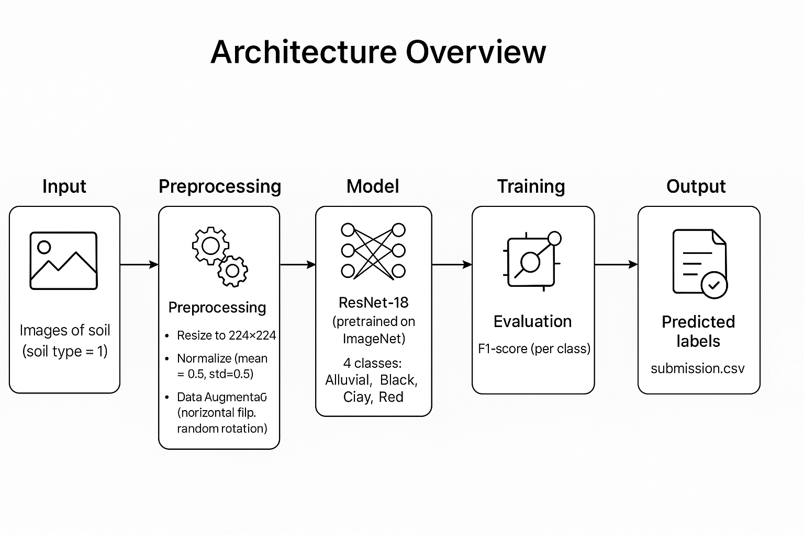

#  Soil Classification Hackathon Challenge 1 - IIT Ropar | Annam.ai

This repository contains the solution for the **Soil Image Classification Challenge** hosted by **IIT Ropar** in collaboration with **Annam.ai**. The goal of the challenge is to develop a machine learning model that classifies soil images into one of four types: **Alluvial soil**, **Black Soil**, **Clay soil**, and **Red soil**.

## 🏁 Competition Overview

* **Task**: Multi-class image classification
* **Input**: Soil images (various sizes)
* **Output**: A prediction CSV with labels for test images
* **Metric**: 📊 *Minimum F1-score across all four classes* (maximize the lowest F1)

---
## 👥 Team Details

**Team Name:** VIR

**Team Members:**(Solo)
- Virendra badgotya *(Team Lead)*


**Leaderboard Rank:** 52 (Part 1)  
**Kaggle Score:** 1.000 🎯


## 📂 Dataset Structure

```
soil_classification-2025/
├── train/
│   └── img_xxxx.jpg
├── test/
│   └── img_xxxx.jpg
├── train_labels.csv  # image_id, soil_type
└── test_ids.csv      # image_id
```

---

## 🧠 Model & Approach

* **Architecture**: ResNet-18 (pretrained on ImageNet)
* **Preprocessing**:

  * Resize all images to `224x224`
  * Normalization: mean = \[0.5, 0.5, 0.5], std = \[0.5, 0.5, 0.5]
  * Data augmentation: horizontal flip & random rotation
* **Loss Function**: CrossEntropyLoss
* **Optimizer**: Adam (`lr=1e-4`)
* **Evaluation**: F1-score (per class and minimum)



---

## 📊 Performance

| Epoch | Train Loss | Min F1 Score | F1 Scores (All Classes)   |
| ----- | ---------- | ------------ | ------------------------- |
| 1     | 12.95      | 0.91         | \[0.97, 0.91, 1.00, 0.97] |
| 5     | 1.77       | 0.99         | \[0.99, 1.00, 1.00, 0.99] |
| 10    | 0.98       | 0.99         | \[0.99, 1.00, 1.00, 0.99] |

Achieved **high and balanced F1 scores** across all classes.
---

## 🔄 Training Workflow

1. Load and preprocess image data
2. Encode labels numerically
3. Split into train/validation sets (stratified)
4. Train ResNet18 on GPU with augmentation
5. Evaluate using per-class F1 and `min(F1)`
6. Predict soil types on the test set
7. Save predictions to `submission.csv`

---

## 📦 Dependencies

```bash
pip install torch torchvision pandas scikit-learn matplotlib tqdm
```

* Python 3.8+
* PyTorch ≥ 1.10
* torchvision
* scikit-learn
* PIL / Pillow
* tqdm

---

## 📌 Submission Format

A `submission.csv` file with the following structure:

```csv
image_id,soil_type
img_abc.jpg,Alluvial soil
img_def.jpg,Clay soil
...
```

---

## 📣 Notes

* The model was trained **only on the training data** as per competition rules.
* The code is modular and well-commented for clarity and reproducibility.
* The evaluation prioritizes **balanced accuracy**, avoiding bias toward any one class.

---

## 🤝 Acknowledgements

* Hosted by: [IIT Ropar](https://www.iitrpr.ac.in)
* Organised by: [Annam.ai](https://annam.ai)
* Dataset: Provided by the Soil Image Classification Challenge team

---

## 🧑‍💻 Author

**Virendra Badgotya**
* AI/ML Enthusiast | B.Tech @ SVNIT

🔗 [LinkedIn](https://www.linkedin.com/in/virendra-badgotya/) | [GitHub](https://github.com/vir123-devf)

---
<p align="center">
  <strong>🌱 Deep Learning Digs Deep!</strong>
</p> 
